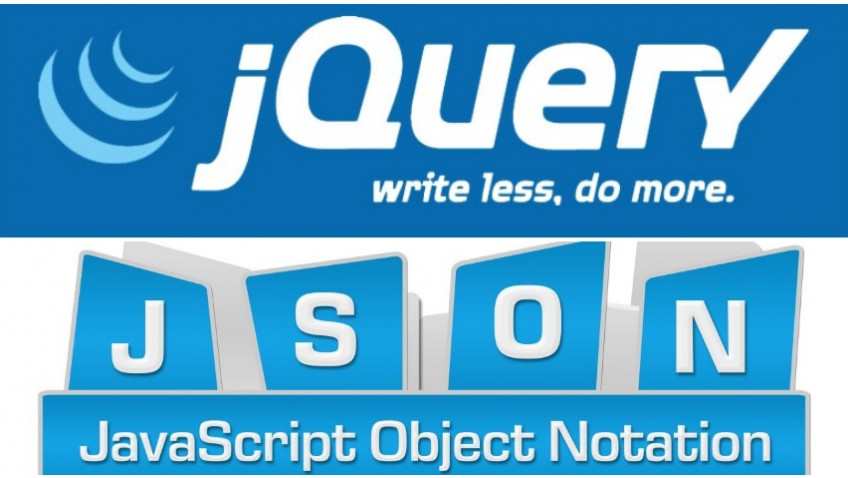

<!--~~~~~~~~~~~~~~~~~~~~~~~~~~~~~~~~~~~~~~~~~~~~~~~~~~~~~~~~~~~~~~~~~~~~~~~~~~~~~~~~~~~~~~~~~~~~-->
<!--~~~~~~~~~~~~~~~~~~~~~~~~~~~~ readme.md of uofm-js-jquery-json ~~~~~~~~~~~~~~~~~~~~~~~~~~~~~~-->
<h2 align="center">JavaScript, jQuery &amp; JSON</h2>
<h6 align="center">by Charles Russell Severance, Clinical Professor University of Michigan (2017)</h6>
 

<h3 align="center"> </h3>
<!--~~~~~~~~~~~~~~~~~~~~~~~~~~~~~~~~~~~~~~~~~~~~~~~~~~~~~~~~~~~~~~~~~~~~~~~~~~~~~~~~~~~~~~~~~~~~-->
<!--~~~~~~~~~~~~~~~~~~~~~~~~~ readme.md of js-jquery-json.bauska.org ~~~~~~~~~~~~~~~~~~~~~~~~~~~-->
<!--~~~~~~~~~~~~~~~~~~~~~~~~~~~~~~~~~~~~~~~~~~~~~~~~~~~~~~~~~~~~~~~~~~~~~~~~~~~~~~~~~~~~~~~~~~~~-->
<!--~~~~~~~~~~~~~~~~~~~~~~~~~~~~~~~ 01. json & jquery logo (01) ~~~~~~~~~~~~~~~~~~~~~~~~~~~~~~~~-->

  

<!--~~~~~~~~~~~~~~~~~~~~~~~~~~~~~~~~~~~~~~~~~~~~~~~~~~~~~~~~~~~~~~~~~~~~~~~~~~~~~~~~~~~~~~~~~~~~-->
<!--~~~~~~~~~~~~~~~~~~~~~~~~~~ 02. university of michigan logo (01) ~~~~~~~~~~~~~~~~~~~~~~~~~~~~-->

### [**About**](#cha)
>#### a.01 [**About**](#cha-01)
>#### a.02 [**JavaScript PowerPoint Slides (ppt file)**](#cha-02)
>#### a.03 [**JavaScript Slides (pdf file)**](#cha-03)

<ol type="1" start="1>
  <li id="#ch1-01">1.01 Welcome to the Course</li>
  <li id="#ch1-02">1.02 JavaScript Overview</li>
  <li id="#ch1-03">1.03 Basic JavaScript</li>
  <li id="#ch1-04">1.04 JavaScript - Core Language Features</li>
  <li id="#ch1-05">1.05 JavaScript - Variables and Expressions</li>
  <li id="#ch1-06">1.06 JavaScript - Arrays and Control Structures</li>
  <li id="#ch1-07">1.07 Code Walkthrough: JavaScript</li>
  <li id="#ch1-08">1.08 JavaScript - Document Object Model</li>
  <li id="#ch1-09">1.09 Code Walkthrough: Document Object Model (DOM)</li>
  <li id="#ch1-10">1.10 Code Walkthrough - Javascript/Profiles</li>
</ol>

>####[**1.10 Assignment Specification: JavaScript/Profiles**](#ch1-10-assign)
>####[**1.10 Installation Handouts**](#ch1-10-hndouts)

>#### 1.11 [**Installing MAMP on MacIntosh**](#ch1-11)
>#### 1.12 [**Installing MAMP on Windows10**](#ch1-12)
>#### 1.13 [**Installing XAMPP on Windows10**](#ch1-13)
>####[**1.13 Installing LAMP On Linux**](#ch1-13-linux)
>#### 1.14 [**Windows: Using NGrok with the Autograder**](#ch1-14)
>#### 1.15 [**MacIntosh: Using NGrok with the Autograder**](#ch1-15)
>#### 1.16 [**Brendan Eich - Inventing JavaScript**](#ch1-16)
>#### 1.17 [**Office Hours Seattle, Washington**](#ch1-17)

### [**Week 2: JavaScript**](#ch2)

We take a quick look at the JavaScript language. We assume that you already know PHP - 
so it is a pretty quick introduction focusing on what is different about JavaScript.

<h4>Learning Objectives</h4>
<ul>
  <li>Describe how and when JavaScript is executed in the browser</li>
  <li>Describe the three ways that JavaScript can be placed within a web page</li>
  <li>Build and debug simple JavaScript code snippets</li>
  <li>Demonstrate how to debug JavaScript errors using the browser developer console</li>
  <li>Give examples of JavaScript manipulating the HTML Document Object Model (DOM)</li>
  <li>Describe the history of the JavaScript language, where and when it was developed, 
    and its relationship to Java</li>
  <li>Explain the asynchronous nature of JavaScript in the browser</li>
  <li>Understand how and when the code in an "onlick" attribute is executed</li>
</ul>

<h4>Welcome to JavaScript, jQuery, and JSON, taught by Charles Severance!</h4>

In this course, we'll look at the JavaScript language, and how it supports the Object-
Oriented pattern, with a focus on the unique aspect of how JavaScript approaches OO. 
We'll explore a brief introduction to the jQuery library, which is widely used to do 
in-browser manipulation of the Document Object Model (DOM) and event handling. You'll 
also learn more about JavaScript Object Notation (JSON), which is commonly used as a 
syntax to exchange data between code running on the server (i.e. in PHP) and code 
running in the browser (JavaScript/jQuery).

It is assumed that learners have already taken the Building Web Applications and Building 
Database Applications in PHP courses in this specialization.

<h3>Module 1: JavaScript</h3>

<h4>Slides</h4>

<ul>
  <li>01-JavaScript.ppt (PPT File)</li>
  <li>01-JavaScript.pdf (PDF File)</li>
</ul>

<h4>Links & Sample Code</h4>

<h3>Introduction to JavaScript</h3>

<ul>
  <li><a href="https://www.wa4e.com/code/javascript.zip">WA4E JavaScript zip (download)</a></li>
  <li><a href="https://www.wa4e.com/code/javascript">WA4E JavaScript source code</a></li>
  <li><a href="https://www.wa4e.com/code/rrc.zip">WA4E RRC zip (download)</a></li>
  <li><a href="https://www.wa4e.com/code/rrc/">WA4E RRC source code</a></li>
  <li>Building JavaScript with Brendan Eich</li>
  <li>Internet Explorer Console Undefined Error (In video link, Basic JavaScript &amp; Code 
    Walk through JavaScript)</li>
  <li>JS Foundation (was jquery.org in video link, JavaScript - Document Object Model)</li>
</ul>

<h1 class="toc_syllabus">Syllabus</h1>

<h2>Week 1 - Introduction to JavaScript</h2>

We take a quick look at the JavaScript language. We assume that you already know PHP - so 
it is a pretty quick introduction focusing on what is different about JavaScript.

<h3>Learning Objectives</h3>
<ul>
  <li>Describe how and when JavaScript is executed in the browser.</li>
  <li>Describe the three ways that JavaScript can be placed within a web page.</li>
  <li>Build and debug simple JavaScript code snippets.</li>
  <li>Demonstrate how to debug JavaScript errors using the browser developer console.</li>
  <li>Give examples of JavaScript manipulating the HTML Document Object Model (DOM).</li>
  <li>Describe the history of the JavaScript language, where and when it was developed, 
    and its relationship to Java.</li>
  <li>Explain the asynchronous nature of JavaScript in the browser.</li>
  <li>Understand how and when the code in an "onlick" attribute is executed.</li>
</ul>

<h5>17 lessons, 6 readings</h5>

<ul>
  <li>1.0 Textbook & Course Resources</li>
  <li>1.0 Syllabus</li>
</ul>
<ul>
  <li>1.10 Assignment Specification: JavaScript/Profiles</li>
  <li>1.10 About This Section</li>
  <li>1.10 Installation Handouts</li>
</ul>
<ol type="1" start="11">
  <li>1.11 Installing MAMP on Macintosh</li>
  <li>1.12 Installing MAMP on Windows10</li>
  <li>1.13 Installing XAMPP on Windows10</li>
</ol>
<ul>
  <li>1.13 Installing LAMP On Linux</li>
</ul>
<ol type="1" start="14">
  <li>1.14 Windows: Using NGrok with the Autograder</li>
  <li>1.15 Macintosh: Using NGrok with the Autograder</li>
  <li>1.16 Brendan Eich - Inventing JavaScript</li>
  <li>1.17 Office Hours Seattle, Washington</li>
</ol>

<h2>Week 2 - JavaScript Objects</h2>

We do a quick look at how the JavaScript language supports the Object-Oriented pattern. 
This is the second time we look at the OO pattern so we focus on the unique aspect of 
how JavaScript approaches OO.

<h5>4 lessons</h5>

1.	JavaScript - Object Oriented Concepts
2.	JavaScript - Building Objects
3.	JavaScript - Object Life Cycle
4.	Office Hours Seoul, South Korea

<h2>Week 3 - Using JQuery</h2>

This is a brief introduction to the JQuery library which is widely used to do in-browser 
manipulation of the Document Object Model(DOM) and event handling.

<h5>7 videos, 1 reading</h5>

1.	jQuery Basics
2.	Code Walkthrough: jQuery Basics
3.	Forms and jQuery
4.	Code Walkthrough: Forms and JQuery
5.	Code Walkthrough: Profiles, Positions and JQuery

<ul>
  <li>3.05 Assignment Specification: Profiles, Positions and JQuery</li>
</ul>

6.	John Resig - JQuery
7.	Office Hours, Barcelona

<h2>Week 4 - JSON - JavaScript Object Notation</h2>

In this section we look at JavaScript Object Notation (JSON). JSON is commonly used as a 
syntax to exchange data between code running on the server (i.e. in PHP) and code running 
in the browser (JavaScript/JQuery).

<h5>9 lessons, 2 readings</h5>

1.	JavaScript Object Notation (JSON)
2.	JSON and jQuery
3.	Code Walkthrough: JavaScript Object Notation
4.	JSON Chat
5.	Code Walkthrough: JSON Chat
6.	Code WalkThrough - JSON CRUD
7.	Code Walkthrough: Profile, Positions, Education, and JSON

<ul>
  <li>4.07: Assignment Specification: Profiles, Positions, and Education</li>
</ul>

8.	Office Hours: Montreal, Quebec
9.	Chuck Pretends he is a Travel Show (Paris)

<ul>
  <li>4.09: Keep Learning with Michigan Online</li>
</ul>
<h6>end of syllabus</h6>

<h4>1.00 Textbook & Course Resources</h4>

This course uses an open and free textbook titled, "The Missing Link: An Introduction 
to <a href="https://milneopentextbooks.org/the-missing-link-an-introduction-to-web-development-and-programming/">
Web Development and Programming"</a>.

Please utilize the Resources section for downloadable slides, web links, and other 
resources by module.

  <b><a href="#table-of-contents">↥ Back To Top</a></b>

<h1 id="ch1">Week 1: Introduction to JavaScript</h1>

We take a quick look at the JavaScript language. We assume that you already know PHP - so it 
is a pretty quick introduction focusing on what is different about JavaScript.

<h3>Learning Objectives</h3>

<h3>Welcome to JS, jQuery and JSON (3:12)</h3>

Welcome to JavaScript, jQuery and JSON. This is the fourth class that we're teaching. And at 
the end of the previous class, you worked on a CRUD application which made it so that you 
connected PHP to the database in a user interface. And we introduced the concept of the 
model-view-controller, where the model is the database, the view is what the user sees, and  
the controllers, sort of the magic that shuffles things back and forth, and redirects the 
user and all that stuff. In this class, what we're doing is what the industry and web 
applications is doing, and that's playing with how we partition the model-view-controller 
across the browser, the server, and the database. Everything you've done so far is rendered 
HTML in PHP. That's the simple thing. And what we're going to explore in this class, is 
moving some of the rendering of the HTML from the PHP into the browser. So we're going to 
learn JavaScript.

And so, building that HTML mark up and sending to the browser's old school and it's 
something you should know how to do. But, to be cool and to be interactive and dynamic, 
to build little chats, the little red things that pop up without having to do full page 
refreshes, that takes interactivity, and that takes JavaScript, and that takes jQuery. 
And so, if you will build a chat application and you'll realize that, chat window can 
go off in the background, get a new chat, and it shows up in the window. So, all this 
stuff where you don't have to do full request-response cycles and we can repaint parts 
of web pages that repaint the whole web pages, that's the kind of thing we're going to 
learn. And that's the fun aspect of modern web applications. We need to learn JavaScript, 
jQuery, which is a JavaScript library that helps talking to the document object model and 
sending that back and forth, and JSON, which is a format that we can cause JavaScript to 
read data from the database and then format it inside the browser. We're going to do all 
kinds of cool things. And that's how we're going to accomplish all these more interactive 
user interactions.

  

This course is probably a little more challenging than the other courses that we've 
done so far. Just because you better know what you're doing, and it's like, here's some 
JavaScript and boy, we're going to do this stuff, and now you got to change the DOM, and 
we move pretty quickly through each of the assignments and the assignments are a little 
longer. So, be ready to spend a little bit more time working on this course, be building 
slightly larger applications. But, this is where you move into a situation where you're 
going to be able to walk into someone doing web development, or an organization do web 
development, you're going to know the stuff that's in this. You need to know the stuff 
that's in this class to sort of consider yourself a modern web developer.

  <b><a href="#table-of-contents">↥ Back To Top</a></b>

Invest a little more time, I think it's worth it and if you got this far and you've 
made it through those first three classes, I'm proud of you, and I'm glad that you're 
still interested, and we'll see at the end of this one, because at the end of this one, 
you're going to know a whole lot of stuff.

<h3>JavaScript Overview (10:17)</h3>
<!-- image -->

Now we're looking at the JavaScript programming language. There's a lot of people that 
might say that the first programming language that you should learn, and maybe even the 
only programming language you should learn, is JavaScript. And I totally disagree with that. 
JavaScript is a wonderful language. And it runs in the browser. And with things like Node.js 
it's increasingly running in the server. And it's a great language. But it's a powerful 
language. It's not a easy to learn language. I mean, you really need to understand what's 
going on. And I'll try to show you some of the awesome things that are true about JavaScript 
that I think you can only appreciate after you learn a couple other languages like C++, Pascal, 
Python and PHP, SQL. Hopefully this is your fourth or fifth programming language that 
you've learned. The other thing that we're doing now is we're moving in a whole new world. 

We've been programming, we learned SQL, which is the language talking to databases. We 
learned PHP, which is the language of this server code that we happened to have chosen. 
We've talked about the request response cycle, we've talked about HTML, and CSS. And how 
we format things and make them look pretty in browsers. I kept saying the Document Object 
Model (DOM), but now we're going to write code that runs in the browser. That's the distinct 
difference. 
If you're running something like Node.js, that means that you are actually 
running server based JavaScript, but for now we're going to talk about JavaScript as a 
browser based tool. JavaScript was invented for the browser. And for its first 15 years, it 
ran in the browser. It was never intended only be in the browser. But it has been a browser 
only programming language for a long time. And its use in servers is creeping up now. And 
so the concept of HTML and CSS and a Document Object Model has been part and parcel of what 
JavaScript has been about from its inception.

From the first moment that we ever had JavaScript, it's been about the Document Object 
Model and how to manipulate the Document Object Model. And add interactivity without request 
response cycles. And so up till now, all the interactivity we've been adding has been by 
displaying a whole new page of HTML. And sometimes we make it look like the page hasn't 
changed, because everything lines up and some little thing changes, but really it's a full 
request response cycle. Now in JavaScript, we're going to learn to play with this Document 
Object Model and change what we see in the browser quite dynamically, okay? So the first 
thing we're going to learn is we're going to learn about JavaScript as a programming 
language. And then we're going to learn how to use it in the browser.

JavaScript has a very different history than PHP or Python. And I like to share with 
you the histories of all these programming languages to give you a sense of where they 
came from. Because I think it really helps you understand what they're all about. JavaScript 
is about 20 years old now. It was introduced by Netscape in 1995, and Brendan Eich is the 
developer of it. And if you read the lesson about Brendan Eich, you will see that it's very, 
very different than the lesson that I encourage you to read with Rasmus 
Lerdorf, the creator of PHP. PHP is designed to be a practical and continually evolving 
toolkit. So PHP itself is supposed to be a toolkit. Rasmus didn't have any formal 
education in how to build languages, but Brendan has got, I think, a PhD in physics. And 
he's a math genius and he's a language genius and he has been a student of programming 
languages. And so the idea of JavaScript was that it was supposed to be built as a toy 
and that's why it's named JavaScript. There's this other language called Java,
which you may or may not know. It's a lot harder than JavaScript and JavaScript was 
suppose to be the easy, baby version of it. 
But in many ways, Brendan was such a brilliant 
computer scientist that he sneaked so many wonderful things. And when we talk about
object-oriented JavaScript, you'll see that it's very different than all the other 
object-oriented things that we've talked about. Because it has a different foundational notion inside of it, called first class functions. And so it's a very 
theoretically beautiful language compared to some of these other ones that were kind 
of compromises, and very practical, but compromises. And there's a standardization body 
called ECMA that standardizes JavaScript, and so you kind of see it named as ECMAScript. 
And if you see it named ECMAScript, don't feel bad about that, it's all the same. And so 
the idea is that JavaScript is a programming language that runs in the browser. And if 
you compare and contrast this with PHP, which we get done talking about. We'd say &lt;?php and
then all this code would run in the server and produce some output that
would go to the browser, okay? But that's not what's going to happen in JavaScript. In 
JavaScript you are having your HTML tags. The JavaScript is actual text that comes from the server and then as the DOM is being parsed it reads this and runs this code. In between the script and end script tag, we are running the language JavaScript. Now, it's not just about writing output,
this happens to be writing output. There is this thing called document, this is a variable that's pre-set for us in JavaScript in the browser. And it is an object that allows us to touch the Document Object Model. I keep saying DOM, well DOM and document are the same thing. So what this is is saying, write to the DOM, a paragraph. And so that takes this text and
it puts it here. So 'One Paragraph' came from HTML. 'Hello World' came from JavaScript. And then 'Second Paragraph'
came from back from HTML. And so it's not like the output of this,
it's not like PHP, where the output is automatically
put in the document. You have to explicitly say,
that's what I want to do. Because it turns out we do little
things like manipulate existing things more commonly in JavaScript. We don't tend to write the entire
Document Object Model in JavaScript. But we do sometimes, and when we get
to doing rendering in the browser, we'll start seeing massive changes in the
Document Object Model coming from that. There's a noscript tag. You might have an application
that would say, you know what, I'm going to function
differently if I don't have JavaScript. These days we don't worry
to much about that. You might just say noscript,
none of my application is going to work, because everything is so heavily
dependent on JavaScript these days. So in any programming language, the first thing that you gotta do is
figure out how to print hello world. And we do this so that we can sort of
monitor our code, see what's going on. There is a function in JavaScript called
alert(), which whatever you pass it a string as parameter and
it pauses execution until you press OK. So in this little piece of code,
and it depends. Different browsers will
render this differently, but in this code this browser is actually
parsing the Document Object Model. And sometimes you might see this 'One Paragraph' show up. And then it runs this code and it stops. And the thing is, when this stops, it actually has not done this next line. And so that next line is not in here. So it has to pause that JavaScript until you press OK. And you'll notice that your browser will keep spinning and spinning and spinning and spinning. And you, sometimes in some browsers you
can't even switch tabs or anything else. Because this alert has kind of not just stopped JavaScript, but it's stopped the entire browser from making any progress on anything. So as a debugging mechanism,
it's really a powerful thing. And if you ever, like watch me coding,
when I'm totally lost and totally confused, I'm like,
is my code even working? I'll put alert statements in, because
they are like, stop everything. And you can sort of look around and
figure what's going on. They get annoying when
you get like ten of them. 

And that's what we'll talk about, console.log, in a second. But alert is a great way to do basic debugging. There are three basic ways that
you can include JavaScript. One is inline in the document, just like I just showed you. You can have it as part of an HTML tag, an event like onclick or onchange, onclick equals, and then in between
here that's actually JavaScript code. Or you can put mostly libraries come in from a large file of JavaScript. And as our applications become more and more interactive on the clients sides, the amount of JavaScript that each page
is including is going up and up and up. So this is an example of an onclick. We've done this with the location href, and I've used used this to like put a button and then change the browser to move to another thing. But basically, this is an anchor tag Click Me, right? And it says whenever this anchor tag is clicked, which means if you click there, then run this JavaScript code. And this is JavaScript code,
it's an alert Hi, and return false. Now see, it just runs it, two line of JavaScript. JavaScript doesn't care about line ends or anything like that, or spacing. And so you just indicate it together with semicolons to indicate the end of each statement. And so the return false, this is like a function call, basically. And if you return false, what that does is suppresses the default behavior. And the default behavior would be that you would click here and it would follow this anchor tag. But if this onclick runs it takes priority, it does the alert and then it says, don't actually follow that link, okay? And so you could return true, and it would follow the link. You could run some JavaScript and then after your JavaScript ran it would follow the link if that were true. But when you click on this, it doesn't actually follow the link. And it depends on this return value being false or true. And so there's onchange and onclick, these are eventing. And this is like in the earliest versions of JavaScript, there was an eventing model that was put into various tags where you could run JavaScript. because it's very much tied to the Document Object Model. Including from a file, it's just like where you put the JavaScript in the middle, except you just have a script and an end script. And then you say source equals and then there is some code in that. This code is not HTML, this code in this file is known to be JavaScript. There's no &lt;?php that has to happen at the beginning of it, it just is JavaScript. So up next we'll talk a little bit about how you detect errors when you're writing JavaScript code.

<h3 id="ch1-01">Basic JavaScript</h3>

So like in any programming language, we can make syntax errors. And it's a little 
different, and so you'll notice that one of the things I have had to bug you about in
every programming language. Like in PHP you had to set the error display message in the 
php.ini file, you had to set the error mode on your PDO so that you would see the errors. 
The problem with having errors, is you've gotta see them as a developer. And so JavaScript 
is kind of weird, in that it runs in the browser as a sort of a side effect of loading a 
web page. And the person looking at the browser is usually not the developer. And so the 
default is that the browsers just hide all of the errors. Sometimes they'll put a little 
red mark in the lower right hand corner or something, or a question mark or something, but 
you don't see it. And the reason is, is the person who is standing looking at the browser 
is not likely the person who wrote the code in the first place. And they're probably not 
a programmer, they're the end user of your application. And so what happens is, it detects an
error and it stops the script execution, but it doesn't notify you. There's no error log 
like we have in PHP, etc, etc. So it's important to know how, when you're writing software 
and doing development, how you can catch and notice errors. because you're going to make 
mistakes as you're developing JavaScript. So this is an example of some broken JavaScript 
code. So we have two script tags, two script tags. And this script tag has a mistake, it 
has a single quote ending a double quote. Single quotes and double quotes are equivalent 
in JavaScript, which is actually quite nice, and so that's a broken tag. And so what 
happens is, is that it comes
in here, and it starts this script. And it's running it, but this is a syntax
error so it doesn't run. And what it does, is it doesn't run any of the remaining script codes. 
So it never says, I am good. It basically gets out of that script block, so that's what happens. 
And there's tries, and excepts, and things like that in JavaScript, and we can talk about that. 
But in this case, we don't have a try or an except, and so it just stops that block. This is one block of JavaScript,
this is another JavaScript. What it doesn't do, is it doesn't
stop all JavaScript processing, it just sort of blows up this block, okay? And so even though it comes down here and
gets to paragraph two, then this runs. And this is good JavaScript, and it runs. And so that's why we see this alert, Second time, is that hope
springs eternal in JavaScript. And when it sees a new script tag,
it's like, well, I'll run this. But it doesn't bother, as soon as it sees a single error,
it doesn't go any further. And sometimes this is library code,
and it's defining functions and stuff. And you make a syntax error, and then all the rest of the functions
in the file don't exist. So you have to realize that
a single error in a JavaScript, either a JavaScript file, or
between a script and end script tag, one error sort of throws
everything after that error away. You gotta get used to that,
it doesn't run any more after that. But we have to see the error,
and like I said, the end user is the one
looking at the browser. And so we need to be able to say hey,
where's this error at? And so we need to make it so
that programmers can see errors, but users are not sort of, they're
not thrown in the user's face. Now the user notices that your
application stops working, but maybe it's not critical,
or something like that. And so we, as developers though,
we want to see it, so we always have to turn something on. What's super convenient these days,
thankfully, is that the browsers have a debugger mode in it, a developer
mode in it, that shows you this stuff. And so you can see the errors by
going into the developer mode. Now sometimes you gotta go,
how to enable developer mode on Chrome, or how to enable developer
mode on Firefox. because sometimes they don't even put
the menus up for how to do developer mode. So that's the first thing you gotta figure
out, is how to get to developer mode. But once you get into developer mode,
you basically get a split screen, and you can actually pull this out and
make it on two screens, or whatever. And there's a lot of ways
that you can show this, I think this little thing moves it out. But under Console,
you can see all the error messages, and you see the fact that
there is an error message. So some developers will actually
make this the bottom part, so you have a screen and the bottom part,
they just leave the Console all the time. And sometimes I'm running other people's
code, and I just watch the Console for a little kind of Easter eggs. One time I saw a Console where a company
was asking you to apply for a job. So that if you're going to their website
and you happen to be watching the Console, it would go like, hey, apply for a job. because you can actually
send log messages, which we'll soon see, out to this Console. Now it's usually pretty effective, and
sometimes you have to refresh the page. But if it sort of knows that you're in
developer mode and it finds something, you can click on this actual link, and
it takes you right in the source code. So you do not have to go View Source,
fool around. It knows all the source code,
it knows what line you're in. Now some of these things look really ugly. There's this little thing that if you
end up with this, what's called minified JavaScript, it's all one big
long line with rat crappy stuff. You can actually make it pretty so
you can read it. But this is taking you right to line
three of the exact code that was broken, telling you what's wrong. You can kind of hover over it, Uncaught
SyntaxError, so that's how you debug it. And so you'll find, increasingly,
as you're writing JavaScript, you'll just have this split
screen on all the time. And you'll do things like clear the logs,
hit the refresh button, and see what errors you've got. And now you're debugging your JavaScript,
and you're using the browser to do it. And the fact that there's a debugger right
in the browser is one of the reasons people kind of think that JavaScript
is a good first programming language. But this whole thing is actually
monstrously complex for absolute beginning users, and
I think it's cognitive overload. But enough of me talking about whether or
not, I love Python as the first
programming language. And then PHP, and then SQL,
and now JavaScript, because JavaScript is an awesome language. I talked about the alert message, but the alert message is really not very
practical because it stops everything. I use alert when nothing make sense, and
I'm like, I'm sticking an alert in here. I've just got to stop right now, because
sometimes I don't know what order things are happening in, and so
an alert would be stop. And it's not like it goes flying
somewhere else, you can see okay, this alert is happening right here. But a far more useful thing
to do is console.log. And console.log, you can kind of look up
all the different functions of console, but console.log basically puts a string. You can also log variables, and
see the contents of those variables, and it's really quite nice. And so you can see the console log, is these are messages that
you're putting out, right? And if you look at this one,
you'll see that the first log appears, then the dialog box stops. The second one does not happen because
the dialog is suspended, and away you go. But the nice thing about this, and
I actually, in production systems that you'll use, and mine, you will
sometimes see log messages coming out. Because I'll be debugging,
I'll say the iframe didn't resize. And I'm like pop up the developer
console and look in the log, and I'm like why is that? What's that red error message? Screenshot that for me, and show it to me. And so I will leave stuff in my
running applications sometimes. Nothing that's revealing
secure information. Of course, nothing that
JavaScript does is really secure, because like cookies it's in the browser,
so the user can look at it. And a smart user can watch the JavaScript
running, can look at the JavaScript, can change the JavaScript. So you can't trust the JavaScript,
even if you wrote it. The thing that's running in the browser
may or may not be your code. Okay, so in older browsers, sometimes the console was only
there if the debugger was running. I don't know which browsers did it, and I don't know what versions
of browsers did it. But if I'm leaving stuff in production,
I will tend to say this. So window.console will retrieve true or
false without blowing up, and then && console.log. And so if this is false, then this doesn't
run, and if this is true, this does run. And it's a way to avoid getting a syntax
error inside of the debugging statement. Another way to do this, and
you can sort of ask in Stack Overflow, what about console? Is console always there? And there's a whole bunch of other things. And so this is really for
older browsers, but I'm still a little conservative
in my applications that I write. You probably won't bother. You'll just say console.log,
and you'll run in Chrome, and it'll just be fine,
and so you'll be okay. There is a debugger. If you get into a source view, you can
find your way into source view, and you can click on a line of
JavaScript to set the breakpoint. Sometimes you sort of have to be in
source view and hit refresh one time. Or if you hit the breakpoint
then you had to hit refresh, unless you're in the pause debugger,
because the page is already done. You hit refresh, the page is done, and
you're looking at this line of code, well that code executed a while ago. Then you can set a breakpoint, and then refresh, and the next request response
cycle is when you're going to see it. So sometimes to activate the debugger, you have to refresh the page
after you set a breakpoint. And so at some point, you're sort of
finding your way around in some source code, you find the code, and
then you hit the button. And this little flag,
this little blue flag shows up to say that you are in the debugger,
that you have set a breakpoint. Then you hit refresh, and then it knows,
it remembers, and it says I'll stop here. So now what it's basically saying, is it's
stopped right here in the debugger, and then you press this to continue. But you can look around at variables and
other kinds of things. And that's really quite nice, but I'm always having trouble
finding my way around. So I don't think it's really great for
beginners, but once you get good at it,
it's a really powerful, powerful environment to figure out
what's going wrong with your JavaScript. So up next, we're going to talk
about JavaScript kind of as a programming language.

<h3>JavaScript - Core Language Features</h3>
So as I mentioned at the beginning,
JavaScript is an awesome language. It is a wonderful language,
it's a powerful language as a developer. But it's also a language, because
it's not a strongly typed language, it's a language that you have
to be responsible and careful. The other thing that's cool about
JavaScript is it's evolving and getting ideas from other languages. Because it's such a popular language
it gets sort of regularly improved for PHP 7 or JavaScript 6. So it keeps getting better and better. And so I assume that you already know
programming languages in general. So I'm just going to kind of highlight the
cool things that are unique to JavaScript that might be different especially because
there's a lot of overlapping between PHP and JavaScript because they're
both C-based languages. They're both inspired by C. So comments on JavaScript Awesome. // which is a C++ comment
to the end of the line. And then /* which is
an older C style comment is a multiline comment that sort
of goes across multiple lines. These are used for documenting functions. That's very nice. Languages that don't have multiline
comments, I'm like grumpy about that. I'm talking about you, Python. Why don't have decent comments? I have to use triple quotes,
which are actually strings! They're not comments, [SOUND]. Okay, so like any C based language,
white spaces and newlines do not matter, statements end with a semicolon. There are certain situations where
you can leave semicolons off, but I tend to just put
semicolons on everything. And go pretend I'm programming in C. A good C programmer can program in C
no matter what language they're in. And here's an example of
a really bad white space, right? This is one sentence. It's ended by a semicolon, console.log. The new line doesn't matter,
the indentation doesn't matter. None of that matters. It certainly matters
to whoever's going to read your code, like me or the teaching assistants.
We don't want to read icky code, but it's a voluntary thing to
make your code look pretty. But you should still do it. Variable names, you can use upper,
lower case letters and numbers. And underscore and
dollar as the first character. Now, it can't start with a number but
you can start with a dollar. And I sort of don't quite
know why they did that. But I think they were trying to make
it seem more like a scripting language. And scripting languages like Perl and
Bash and Python to some degree have, PHP have dollar signs,
not Python, has dollar signs. And so they we're trying to sort
of make it a more approachable and easily understood language. And so generally people just say,
don't do dollar signs, they're tacky. And then it pretty much
functions like any normal and decent programming language in
terms of the variable name choices. Case sensitive matters,
but don't play with that. We can use case to mean stuff, but
don't create a variable called bob and Bob and expect them to be different. They are different, but don't do it. You just make people angry who
read your code at that point. String constants are nice in JavaScript
in that they are the same for single quotes and double quotes. Though the escaping like the new line,
of course, this whole \n stuff, that's a C idea,
so you see that in most C languages. What we tend to do in JavaScript, and it's
kind of the same in PHP, is we tend to use single quotes in JavaScript because
double quotes are required in HTML. So the script tag is HTML, /script
tag is HTML, this is JavaScript. So I in my own thinking, I tend to use single quotes whenever I
possibly can in JavaScript to avoid. So I can just look at a line of code and
go that's the JavaScript, that's not the HTML. because we're often mixing HTML. And sometimes we're writing document.write
that has HTML and it's got double quotes. Single quotes for the string, double quotes inside the string
because we're writing HTML. And so, reserve the double quotes for
HTML whenever you possibly can. Numeric constants work the way
that you would expect. And now we'll talk about some of the features
of the JavaScript programming language.

<h3>JavaScript - Variables and Expressions</h3>
So one of the important parts of any programming language is the operators and the expressions. 
And so these, of course, are very much like all C-based languages. We have our plus, minus, 
multiplication is asterisk, division is slash. Division, unlike Python2, is it creates floating 
point based on just like you might expect from a calculator. So if you take 9/2, you get 4.5. 
Modulo, which is an integer division that gives you back the remainder. And then there are these 
side effect operators like k++, which is the same as k = k + 1. So we get a -- and you can have 
these ++ or --, either in the back or in the front. You can also have side effect operators 
like j += 5, which is the same as j = j + 5. And again, these are contractions that we tend 
to avoid, unless, we have a reason to kind of make our syntax really dense. The comparison 
operators are very much like PHP and the C language. So we have, the big thing to remember 
is that there's an assignment statement, that's the =, and == is the question mark. So asking 
the question is j = 10? is double equal sign. And then, from that not equal flows, less than, less than, greater than, less than or equals, all are kind of straight forward. And there's two kinds of equality operators, one is the ==, which is effectively numeric equivalence or equivalence after type conversion. And then the ===, is comparison without type conversion. So if I put false into j, and we had the same thing in PHP, false into j. And let's say, is false numerically equal to 0? And the answer is yes. Is false identical to 0? And the answer is no, it is not, okay? And is false identical to false? Yes, it is. And there is also a not triple equals. And again, these are very PHP like. It's funny, I like these. I was probably going to do some programming in Java, the big language Java. And I didn't have these, and I'm like, Oh if it's false. But in Java, the equality is different because you don't do auto type conversion. And so in languages like PHP and JavaScript to do automatic type conversion, you have to have an equality test that stops the automatic type conversion, because this implies an automatic type conversion. In the language like Java, that's a strict type language. You can't have two types. You can't check the equality of two different types because just a syntax error. But in JavaScript, we have numeric equality and absolute equality, which is type and value. The logical operators are, again, straight from the C language. && is logical AND. So both sides must be true. true && true becomes true. OR, meaning either side, you know, true || false becomes true, because only either side has to be true. Greater than. Greater than and NOT, in logical expressions are as an !, like in C languages. If we're looking at that, that would be exactly as it is in C. And if we're looking at all of these things, they would be exactly the same as the C language and the Java language, except these things are, they're used in C like languages that don't have strict typing. Concatenation. PHP, I love the dot concatenation operator, but I accept the fact that it will never be in any other language except PHP. We use + to do concatenation. And then of course, it does string conversions automatically. It's not like Python where you've got to get the types exactly right. The + simply says: "Oh, I got a string and a number. Let's turn that number into a string so I concatenated it together." And so, x becomes the string 12. And so we concatenate "Hello 12 people". And like all languages, this doesn't add a space. And so these two spaces are explicitly put into the string so that they actually work. JavaScript is a loosely typed language. There's a video that perhaps, I'll put a reference elsewhere to, that's kind of funny, about how adding things together, different types, it's all very consistent, but it's not something that a beginner would predict. And so in this case, let's just take a look at some silly things. 123 + 10. Well, is that a numeric? Well, in PHP that would be deterministic because + is a numeric operator, but + is not a numeric operator. It might be concatenation, it might be a numeric. In this case, it sees it as concatenation. And so we get a string "12310". But multiplication is a numeric operator. So, "123" times 1 is the number 123 and then you add 10 to it and that's 133. And this is different than PHP, the string "fred" multiplied by 1 that's a numeric, no numeric operation. And instead of pretending that fred is zero like PHP would do because PHP is very loosely typed, JavaScript has this notion of Not a Number (NaN). And so, when it looks at "fred" and tries to convert "fred" into a number, it goes that's not a number. And then not a number * 1 is NaN. And if you take x which then ends up being NaN and then + 1 to it, NaN + 1 is still NaN. So that NaN is kind of a sticky thing. And it just kind of fun to look in some UI and blah blah blah blah blah NaN. And it's always, you know, uppercase and lowercase and and you're like: "Oh they did some conversion." They're just some calculation in JavaScript and it didn't work out so well. And so you see NaN in all kinds of user interfaces and you know that they're doing math in JavaScript and they got some kind of a bad value divided by zero or took an undefined thing and multiply that by something else. And then they printed it out in the document object model and it came out as a NaN. That's kind of a running joke of JavaScript is that NaNs. So NaN, like I said, is sticky. You can check to see if a variable is a NaN, like isNaN() is a function that returns true or false. Dividing by zero gives you Infinity. And these are actually, so JavaScript seems weird in this case, but in a way JavaScript is, sort of, more right. So dividing by zero shouldn't be, you know, an error just Infinity. So that's what it is mathematically. And there's situations that are mathematically NaN. And so, there is kind of an underlying official standard for how numbers are supposed to function, and JavaScript is probably closer to those than other languages like PHP. So, even though we make fun of NaN all the time, it's probably a more responsible numeric implementation than some other systems might have. There is a typeof operator that can tell you whether something is a string or an integer or whatever. And it returns itself a string, which means that you can put that in 'if' statement. You can say if typeof variable == "string" and it will tell you something, and that's a common thing that we do. Functions are an important part of any programming language. There's lots about JavaScript functions that are exactly as you might expect. There's a function, this again very C-like function, name function arguments to the function. The arguments by default are passed by value not passed by reference, and then you can have a return value and that all sort of works the exact way that you would expect in any other programming language. So, that part's pretty straightforward. But the weird part, someday I'd like to know why. But the weird part is, one of the things that I always talk about when I talk about functions is how they are like isolated by default from the outside world. The only thing that we touch are the parameters that go in and the return value that comes out. And the stuff that goes on in the function, generally, does not sort of bleed out into the outside world by default. Not true in JavaScript, super not true in JavaScript, freakishly not true in JavaScript. So in JavaScript, if there is a variable, you're coming down and this is done in sequence, the fact that this gl is before the function actually matters. Because it's sort of evaluating this in order. And it looks at this thing and says: "Oh, you didn't tell me that this was local and there is a variable that's global, so I'll just make these two things the same." So at this point, we have gl out here. It ends up with 123 and then this code runs, and it's the same gl, and so that changes this to 456. And so, when we run the check function, it changes to 456, and then we print it out, and out comes 456. I think that's like a not a very good feature by default but it is and we can't change it. So one of the things you see in JavaScript, all responsible JavaScript programmers have used var, var, var, var, var. Like, don't forget to use the var. So what var says is, var, effectively, draws what I wish was default to say this is a local variable, even though there is a variable globally of the same name. This gl does not, sort of, smear out or percolate out beyond its boundaries, somehow. And so in this case, there are two gls. There is a gl in here and a gl out here. This one gets 123 in it. The code runs. This one gives 456 in it. Then the code comes back and then the global one is unchanged. And so, that's really the way you want it. So, you think to yourself, why do I have to keep doing this? You've got to put var in. I have written a lot of JavaScript where the mistake was like, why isn't this working? Well, it's because I didn't have the var. I'm like, put the var in. So, just get used to it, it's a little weird, you have to explicitly mark variables within functions as if they are local. So, you have to explicitly say it, it's not like any other, well at least most other commonly used program languages don't do that. So next, we'll talk about arrays. Arrays and objects are always sort of the fun part of any programming language.

<h3>JS - Arrays and Control Structures</h3>
So like PHP and Python and the other languages that we've been familiar with, Javascript has Linear Arrays and associative structures but the associative arrays are actually objects and so we'll kind of talk about them in more detail in the next major lecture where we talk about Object- Oriented Programming. It's kind of interesting that in Javascript, you have to learn about Object-Oriented earlier than other languages, another reason why I'm not a fan of Javascript as first language. But it turns out that Javascript objects are super powerful and flexible and gorgeous and so we'll get to them. So, a Linear Array is quite straightforward. You say [ ] and then you have commas and that's an array. Now, the interesting thing is if you read about JSON, you might have actually seen the Javascript notation for arrays and objects already because JSON is exactly the same notation and it's similar to Python as well. This is a Linear Array, that's 0, 1, 2, 3, 4, and then you can have key values things, but these are objects, not arrays and we'll get to that. You can say a[0] which will get you the zeroth thing, "x" and b['name']. This is the part that kind of confuses people because that basically says, go into the object b and look up the attribute "name". But that's in quotes and it just is a little bit strange but you can kind of pretend that objects are associative arrays and you can even make them just like you made an object that has no quote in it but it just has data in it as a set of key value pairs. People coming from languages like PHP that expect associative arrays to have key value capabilities, they just kind of make objects and don't worry too much about it. We'll get the objects in greater detail later. You can also kind of construct arrays through various ways, you can make a sort of fresh empty array and then push things onto the end of it so you can have this array and you keep adding to the end of these things. Push, push, push, and so we end up with "first" and "second", or you can say array [0] equals "first" and array [1] one equals "second" and then you end up with an array that looks like that. So, that's another way of kind of building an array up from little pieces. You can also use the constructor style where you just put the list of things that you want in the array. This little bracket syntax is sort of a shorthand for the constructor style of making a, in this case, two element array. Control structures, again, since you're coming from PHP, we're not going to go over everything that's the same as PHP because operator is the same as PHP. "if" statements are like PHP, while loops are like PHP, for loops are like the PHP counted loops. All right? We'll talk about that, and break and continue work a lot like PHP. That's part of the reason that I like teaching PHP first because they're both C-like languages and then I can go on and just say, hey, remember all this stuff we've done in PHP? There is a difference between the definite loops and PHP use 'foreach' but in Javascript, we use 'for'. In this case, we're going to say for ball in balls, which is kind of a little Python-like actually, this is the iteration variable and this is the collection. This is an object but don't worry about it, we'll just pretend it's a key value array for now. This basically says is that ball, the iteration variable is going to go through the successive keys in here and then we can just say balls[ball] to look up these values, the corresponding values as you go through. It doesn't have a Python-like to iteration variable thing. This will loop through and go through and hit them all. Up next, we're going to talk about playing with the Document Object Model in Javascript.

<h3>Code Walk-Through: JavaScript</h3>
So, one of the first things I always like to do when I am programming is how to get a debug statement. Okay? And the alert() takes as a parameter, a single string, and it prints it out. So here's a very simple bit of JavaScript. The browser sort of runs this and it stops. And depending on your browser, it may actually stop when in the middle while the page is still displaying. So let's take a look at this particular one. Let me clear this and go and run this one. Here's the sample code. Run this first one where you saw that one, make this just a little bigger here. And you see this little thing is still spinning. Right over here, it's still spinning. And that's because it's sort of still processing the page, and the alert has actually completely stopped the JavaScript. So the thing is going to happen right after the alert, won't happen until I press OK and then it finishes. Okay? So the alert stops right now, and it's really stopping the interpretation of this page. So alert doesn't just print out output, but it stops JavaScript processing. So it's a pretty strong form of debugging, if that makes any sense. So alert is just an executable statement. There are three ways that you can put JavaScript into a document. One is inline within the document using a script tag. You can also put it on things like onclick methods on things like hrefs, et cetera, or you can include a whole file. See all of these examples. So this is some code that we've sort of been playing with all along, but now it is time to sort of understand what's going on here. So this is an anchor tag that is this tag right here, and we have an onclick method. So this is within the anchor tag creates, and it says when someone clicks on this anchor tag, I want to run this JavaScript right here. So the bit in between double quotes is JavaScript. And JavaScript can use single quotes or double quotes of strings. So we tend to reserve the double quotes for HTML. So onclick="something" That's HTML. And then 'Hi', single quotes, in this case, is some JavaScript, and we're calling alert. Now, return false has to do with, normally, if you were to click on an href, it would actually follow that link. Okay? But if you say return false, it won't follow link. Just run this code and not follow the link. Okay? So, let's take a look at that one. So if I click, it's going to actually run the JavaScript rather than doing what it normally would do. And if you recall, it would go to js-01.htm, but it's not going to because we did the return false. Okay? So return false is the way to indicate that we don't actually want to do what normally would have happened if the click happened. So you can do both the onclick method and then let the tag do what it normally would do, or you can say, "I'm taking over and doing that." So this is just one form. We're putting JavaScript right on a tag. So here's another way to do it. And so this, when we show before, where we just did a script tag and an end script tag and then had document right. You might see something like this on HTML5. We tend not to do this, but this is validation to make sure that the JavaScript passes a strict HTML 4.0 validation. But that's less important as we're moving to HTML5. So we talked about this one. And then the third way to do this is to actually use the same script tag and say, "I would like to load this file." And this then script.js has to be a file that has some content in it. And in this case, we just have one line of JavaScript. We don't have a script tag. It's just JavaScript itself. It knows that it's JavaScript by the fact that we're inlining it. And so that's as if we typed all that stuff here. Now, this is kind of a silly little example. It actually just moves that document right into the file, but that's another form of including JavaScript that you will commonly see. So syntax errors in JavaScript are a little bit different. I mean, we can make mistakes, it's a programming language, but the problem is that most of the time you're using a JavaScript page that you did not write, and you're just using Twitter. And if there's a JavaScript error in a Twitter page, you, as the Twitter user, it doesn't do much good for you to be told that there's a JavaScript error because you can't fix it. Syntax error, missing semi-colon, who knows what it's going to be? So the browsers tend to be very, very silent about any kind of a JavaScript error, but the code dies. Sometimes, there's a little red icon that shows up in the lower left hand corner. So here's just an example of a bit of bad JavaScript where we're just going to have a double quote that starts and ends in a single quote. So that's a syntax error. And what we will see is that this will run, it will die here, so this code doesn't finish, but then it actually gives up on that script block and then continues, and you'll see that this one will run later. Okay? So let's go ahead and show this, js-05. So it did not tell us anything about that first syntax error, but it didn't run that second alert. And then it actually finishes. Okay? So like I said, the end user is really not supposed to see the error, but we, as a developer, need to look for errors. And so as we're writing JavaScript, you instinctively, something won't work, you make a change and it won't work and your brain's got to go like, "Oh wait, wait, wait, I made an error. I've got to actually explicitly look for it." And so there are developer modes in all of these browsers. I'll play with the Chrome one here. So let's take a look at how you turn on developer mode. Sometimes you have to enable this little message to just show up. But at the end of the day, I can like to view JavaScript console, and I'm going to hit refresh, and you will sort of see what's going on here. It runs, but I see the error, and I can even click right here, and I can see the exact place that the error happens. So increasingly, these browsers all have nice debugger modes in them, and I just popped up a debugger, and it's got this little thing, and I can look at the console. I can look at the code and go back and forth. And so this is a useful thing, and you, as a developer, you'll tend to often just leave this sitting down here at the bottom when you're working on code all the time, where it's like, "I just leave this on all the time." You'd kind of do it with console, and you run it, and you see something like, "Oh wait, wait, wait, wait." And then you know how to go look for that error. Okay? So that's very important because there's no good way to see these things, unless you've got this console turned on. Sometimes your browser will say go look up JavaScript errors, but it really wants to hide these from end users. You, as the developer, the website have to get the stuff right. So alert is kind of a blunt instrument, in that, it stops running the code, and sometimes you have a loop or something, you want to put some debugging in it. And so these debuggers have added a console.log method, and you can pass in a string, and you can console.log all kinds of stuff. And so basically, what you can do with a debugger turned on is, you say console.log and it'll come out in the log. And so this same console.log that we were seeing allows you to see things, and it just runs. So that console.log is a very useful thing, and it allows you to even inside of a loop or inside of an event or an onclick method to be logging stuff without stopping. If you do an alert, it stops. But if you do a console.log, it just streams by in the debugger window. And if you don't, the end user doesn't see this, only developers might see it. So I tend in some of my sites, you can go look at them, and you'll see the consoles talking. And you can see a play by play of what's going on inside of one of my sites. Now, depending on the browser, the console object may or may not always be there. Sometimes it's there when the debugger is on. Sometimes it's not there when the debugger is off. So my favorite thing to do is, whenever I'm going to do a console.log, I say window.console which won't cause an error, &&. So that means that if a console exists, then I will call console.log. This is just a real succinct way of saying that window.console and console.log. Another way to do it, you can look up all kinds of ways to deal with console.log. This is my preferred way to do it, but if the console function doesn't exist, console variable doesn't exist, it sort of sets that up and sets a log function. But this is my favorite way to do that. So the debugger, as we mentioned, is a great tool for debugging JavaScript. You can pause the debugger. So let me show you how to do that. Let me go back. You can pause code. Sorry, got to clear that. Pause code. So here's js-01, right? And I can look at the source, and I can put a breakpoint here by clicking right there. So I now have a breakpoint at that point. Now, the page is already run. So once I set the breakpoint, I've got to hit refresh once to load the page. Now that knows where the breakpoint is supposed to be, it'll run up and stop at the breakpoint. Okay? And so now, it is paused in the debugger. You can see this pause in the debugger. You see this little spinny guy, meaning the page isn't done loading yet because we've stopped it and we can look at variables and global variables. There's all kinds of stuff that we can look at, Document Object Model, all kinds of things. And I just click right here to continue the debugger. And so the page completes. Now that's a very, very, very simple introduction to using the JavaScript debugger, but it is very, very valuable and you'll get used to how this all works after awhile.

<h3>JS - Document Object Model</h3>
Now we're going to talk a little bit
how we manipulate the Document Object Model from JavaScript. And so here we are in our happy
little Request Response Cycle. And so the Document Object Model,
of course, is how we out here in the real world,
we view web pages, right. That's what we're seeing. So what we're going to see now is we're
going to have a Request Response Cycle that's going to write to have JavaScript
in it but that's no big deal. You'll notice that all these files
I'm playing with now are HTM files. So they're static files they're not
even running on the server at all. But inside they have some JavaScript. And now we're going to look
at how JavaScript can look at things from the Document Object Model. Look them up and pull them out and then put stuff back in
the Document Object Model. We've already saw how you can
use document.write() to append to the Document Object Model,
and we see these things. And so this is the core essence of interactivity that does not
require Request Response Cycles, when we can manipulate the Document
Object Model interactively in JavaScript. Now in the next few lecture we're going to
come up with all kind of ways which JavaScript is going to talk to the server
and then update the Document Object Model but for
now we're really just going to focus on this bit code right here with JavaScript
is manipulating the Document Object Model. And not worry about the other cool
things that JavaScript can do. Okay, so the Document Object Model has
been around since the beginning of time. And when JavaScript was created
the Document Object Model existed. The problem is in 1995, all these
browsers kind of evolved independently. They all had sort of
an internal data structure for how they would represent HTML once they
parsed it, but they weren't the same. And so because the inconsistent
is a Document Object Model. And because they knew that they
could never get JavaScript out, if they set every Document Object Model
has to be the same. They didn't force
the Document Object Model's shape. The structure of what's a child of what,
inside the Document Object Model. They never force that to be the same. Okay, and so there's other ways
that we have to go look things up. You can always look things up but
that's not as portable. So, like I said, not all browsers
represent their page exactly the same way and in old days we'd write
JavaScript code and then we have to debug and said in IE 7.3.1 You
just blew up, but everything else works. And Firefox works,
this works, and that works. That's less of a problem these days,
but we will see. And so we would end up with
bugs that are just like, this thing works on everything but
Internet Explorer. Blows up, and no options display. And this would be an example where
you're writing code as a developer, and you tested and tested on Firefox, but
then you put it in production and someone used Internet Explorer. That happens all the time. And it's very, very, very frustrating. But, it's still important
to be able to do basic, simple things to
the Document Object Model. And so what they did is because
the shapes weren't the same, and so what I mean by shape is this
comes here, the document and the forms are down here, and
the iframes are over here. What comes underneath these things? And there was a hierarchy that you
could go like DOC.X.Y.Z[4], and that might be the fourth form or
something, right? But the sequence of these
things is different. So the shapes in IE,
Internet Explorer, or Chrome, or whatever, had different
Document Object Models. because that was sort of treated as just a
thing that the browser was allowed to do. The developers of the browser were
allowed to architecture their own Document Object Model, based on what they
thought was the coolest thing to do. And so the idea was that in the early
days of JavaScript they said we are not going to standardize the document model,
but what we want to do is we want to be able to find something deep in
the Document Object Model independent of, we don't know what the shape is, but if
we can mark this one with id="bob". Then I want to be able to
grab this little thing, not knowing where it fits in the tree. But if we put an id tag on it, and that is a function that was built into all
the object models called getElementById. So instead of going and starting
a document and working your way down, you just say look I don't care,
you go find the one that has id="bob". And so that's called getElementById. So what we do is we use this id tag. And we've seen this in CSS. We've used this in CCSS as well. But we also can use this in JavaScript as
a way to distinguish a particular tag. Now there's the class equal and
the id equals. You can only have one tag in an entire
document that has the same id. So id equals person, there can only
be one tag that has an id of person. So we are marking somehow this text,
Chuck. Okay, and saying, so this by the span
tag is just a tag that does nothing. All we're doing here by putting an id
on is giving us a handle for that text. And so now what we can do is we
can come into our JavaScript and we can say
document.getElementById('person'). And that says, go through your
whole Document Object Model, wherever that thing's at. And find me this tag. So this bit right here,
that bit right there is what you get. You get the tag span id=. It's not the text, it's not Chuck. And if you want to go down, and you
want to go deeper to get just this bit. Then you say, .innerHTML so
that pulls this stuff out. And so that's where it says
string equals Chuck down here. So it's actually pulled the actual text. You go find the tag and
then dive into the tag. And sometimes the tag
itself has children in it. So sometimes it's quite complicated, but in this case I just had a span tag with
some innerHTML and away you go okay? And then It doesn't have
to be that we just, this is basic looking something up
from the Document Object Model. And then I can console
log it at console.dir, the disk shows us this and it's really
nice because then you can expand this. And you can see all the little
details that are in that tag. And that's a good way of debugging and
then writing code. And then I can actually change it, so
I go document object and HTML so this actually is a handle to this Chuck text,
whatever's between those span tags and then actually rewrites the Document Object
Model and puts Joseph in there instead. So if you were to see that
you'd see Joseph on the screen. And so,
that's what you see afterwards, right? And if you can expand that document.dir,
this is what's quite nice about this, is the console.dir. I think console.log because roughly
the same thing, if you like. It gives you this, and
you can look down through things and scan. And that's how you can find
things like innerHTML or whatever because you can see all
this things and child nodes for example is if our span tag which is in
the Document Object Model somewhere this is our span tag, that's our span tag
it can have child nodes that go within it. So that would be span within something. And so here's a little bit of code that
is JavaScript that's running an onclick where, and again, when you start
doing JavaScript in the browser and you want to mess with the DOM you tend to
Add id's on tags to give yourself handles to various pieces so you can change them,
delete them, put new stuff in them. And so here's the span on
this string stuff, right? The string stuff right here,
I've got a handle id="stuff". So I can grab this tag document id,
this is a an onclick for this Back button. This 'BACK' is onclick that runs this
JavaScript as soon as I click on Back it's going to run this code. And it goes, grab that tag, and then take
the innerHTML tag and stick BACK in. So that basically puts B-A-C-K. So if I press Back, this DOM, without going to the server,
this DOM just changes to BACK. And if I click Forth. Click this Forth, which is this Forth. Then that goes and
grabs this same thing, and then the innerHTML is changed to FORTH. So that wipes that out. FORTH. And it looks like that. So you can go Back, Forth, Back,
Forth, Back, Forth, Back, Forth. And this stuff is just changing. And this is just really simple
basic browser interactivity. Here's a little bit of code
that's a little more complex, that's manipulating
the Document Object Model. And so, what we're going to do is we're
gong to have this little more tag, and we're going to have onclick method. The href means, that's a way
that we say don't load anything, that it's not really a link to anywhere. It's an interactive thing, it's going to make something
happen inside this document. And so whenever we click on that
we're going to call the add function in JavaScript and then return false
to avoid going to some page, right? And so now what we're going to do is
this is all just HTML at this point. HTML, HTML, HTML and
we're going to make a ul tag and we're going to put an li tag in there. First item so if you first look
at this page you'll see that and nothing else and then we're
going to having some JavaScript So in this JavaScript, we're going to set
a global variable called counter to be 1. We're going to do console.log just for
yucks. And then we're going to create
this function called add. And this function called add is going to
be run every time we click on that. So it's going to click,
run add, return false. Click, run add, return false. So every time we click on
this what it's going to do is it's going to do
a document create element. So what that does is it creates an li tag,
/li. That has nothing in it but it's not connected anywhere
to the Document Object Model. You can give it a class. This x is this thing. You can put a class equals on it. Okay, put class equals on it,
that's what this does. Now we can set the innerHTML
to be the counter. And then whatever this variable is,
counter. And then add one to it, well. Then what we're going to do is
we're going to graft it in, so we're going to grab this li tag, a ul tag which is this tag right here,
and we're going to add a new child. So the way think about this is the ul
is the parent and the li is the child. What we're doing is adding another
child to it, another li tag. So this was the li tag we
kind of made out here and then we connect that
li tag to this ul tag. Then, we add one to the counter. So the counter equals one. Then we would do this again, every time we click this it is going
to run this over and over again. So a new li tag gets added,
every time we do this. And there is no request
response cycles going on. We have the DOM and we have JavaScript and
it's just changing the DOM and as soon as the DOM changes, you see this. If there was stuff down here,
it will get reformatted and moved down. And so you change the DOM,
it reformats, it rejustifies, it does all the kinds of
things that is going to do. And so this is an example of generating
dynamically some HTML that we can see by manipulating the DOM and
doing various things. Now, that's how we did it in the old days. That's 1995 to 2005, 2006. For ten years, we wrote code like that. And the problem was is it wasn't portable. And it was kind of just long. Lot of little details, but you can do it. But, it was so clunky, and
there's so many things, and as we went to build
cooler interactivity it got, the amount of code you had to write just
got bigger, and bigger, and bigger. So, a series of libraries in the mid
2000s, 2004, 2005, 2006 came out, that tried to make job descript in the
DOM, a more functional way to write code. And a number of them came out,
Mootools, Prototype, but the one that everyone loves now
over ten years later is called jQuery. And so what jQuery did is it solved two
problems, it made messing with the DOM really easy and portable, So
jQuery knows all the browsers, and all the quirks of all the browsers,
and you say, in jQuery, do this. Go find this tag and do this to that tag. And if there was something you had
to do for a particular version of a browser, jQuery would worry about that. And so, jQuery solved the portability
problems, they solved the DOM differences, the underlying functions. Things like how wide is the window? It used to be you'd have an if statement
in this much code to figure out how wide the window was. Whereas in jQuery, you're like,
how wide's the window, and it has the if statement in it. So it's really amazing. And we really, at this point, it's rather rare to do anything other
than the simplest kind of manipulation. And the DOM without using jQuery, so
many people just assume that jQuery is always there but it wasn't always there,
it wasn't there in the first ten years and it was so painful in that first ten years
that things like jQuery had to be built. And so, when we start talking about jQuery
well, I'm not going to do much more on DOM manipulations until we start
doing that with jQuery. So, this is a quick
run-through JavaScript. How we can write code
with the basic syntax and languages all the way up through
manipulating Document Object Model using kind of early version,
the first ten years of JavaScript. And you still do that. Sometimes you want to keep your page
really small and you only want to do a tiny little thing so
you can revert back to getElementById, and that kind of activity. Especially as old browsers go away
the portability issues are less and less of a problem. But as we really start playing
with the Document Object Model, we'll play using libraries like jQuery.

<h3>Code Walkthrough: Document Object Model</h3>
So here is a string, Chuck,
it's wrapped in a span tag and the span has an id of person, okay? And so here in my JavaScript I say
document, everything starts with document, getElementById and
then I give the id that I'm looking for. And then that basically looks
through the whole page. Looks through the whole page and it finds the thing that has the id of
person and then, let me clear this. Then this little expression
right here is this tag. So you basically have
gotten yourself a handle, st is the variable, this st variable. That st variable is a handle
to that little part, okay? And then you can do things and we can do
stuff to the outer part of the tag and everything. But if we just want this HTML we
have to say gimme the innerHTML. So I say .innerHTML and
that dives into the tag and pulls out the actual HTML text. That's the child of that tag. And I can print that out, and
I can also change it, right? I can also change it. So I can put it on document.getElementById('person').innerHTML = 'Joseph'. Well, that is an assignment
statement that's going to overwrite this part of the Document
Object Model and change it. And I have a couple log statements. So let's play with this
particular one right here. This is js-13. Okay, so if we recall, it goes in, it finds the id tag of person. Then it prints out how much, lets switch
to console, I can't wait, wait, wait, let me switch to console here. [LAUGH] I mean,
once the alert's up I can't switch right, because the alert has taken
over the whole browser. So I am going to switch to console so
I can watch it in console. And then I'm going to clear the console
and then I'm going to press refresh so that I can sort of watch it
all happen in the console. Okay, [COUGH] so
it looked up the span with id = person, pulled out the innerHTML. It both logged it in console.log and
it did it in an alert box, okay? [COUGH] Now this browser's frozen. This browser's frozen because,
The alert box is up. And it's not going to do
anything until we press OK. So I'll press OK, which means the JavaScript is
going to start back up again. If you recall what it does,
it first puts out a log that shows what kind of a thing
that object is, that st object. And then it changed it to Joseph, and you'll notice that it
changed it to Joseph. Literally, my JavaScript code changed
the Document Object Model, and the browser is always rendering whatever
is in the Document Object Model. So my JavaScript changed the Document
Object Model, the browser's just poof, rendered it. So I'll do this in faster motion. So the original HTML had Chuck, we looked
that thing up, as soon as I hit this OK, it's going to change it to Joseph,
and it just changes to Joseph, okay? So if I didn't have the alert,
it would happen instantaneously. It would happen so
fast you wouldn't see it. And I can use console.log to
kind of keep track of stuff, right? And so you can sort of work
through this thing and see all the stuff that's happening. I make it go in slow motion
by putting this alert in. I could also use the debugger and
a breakpoint, if I wanted to, to see that, but I just want to stop it. So this is looking it up,
pulling stuff out, and logging it. And then it alerts to stop it, mostly. And then it changes it and continues on. Yeah, so here's another one that basically
is sort of combining an onclick. And so what's going on here is I have two
links, well, it's probably easier just for me to show you how this works. This is js-14, So js-14. Okay, so
if I look the word Stuff is in here. So I have a span id="stuff" and I have an onclick the word BACK and
FORTH, right? So I do a
document.getElementId('stuff').innerHTML = the string BACK. If I click on that, then I return false. Remember you gotta return false. And then if you click on FORTH it's
going to change that text to be FORTH. So what I'm doing is
overwriting this stuff, right? I'm grabbing it I'm
going to change it to BACK, then I'm going to change it to FORTH. I'm going to change it to BACK and
then I'm going to change it to FORTH. And this all done on these clicks. But it starts out coming from
the server with Stuff there, right? because that's whats in
there in the first place. Them I click on this href, this href,
and it changes the DOM to be BACK. And I click on this href and
it changes to be FORTH, okay? This won't be very exciting. I click on BACK, it looks it up
in onclick, it looks it up and then changes it to the word BACK. Sorry. There we go. I click on BACK, I click on FORTH. I actually don't have any JavaScript
to reset it back to Stuff. Unless, of course, I hit refresh and then
it pulls another copy from the server and it's its original form. These are just going BACK and
FORTH and changing, okay? Fascinating, hit the back and
forth, fascinating. Okay, and so that's basically causing
things to happen as response to clicks. The previous example we just sort
of had straight line code that just ran.

<h3>Code Walkthrough: JavaScript/Profiles</h3>
Hello and welcome to Web Applications for Everybody. In this walkthrough, we're going to walk through the assignment that's associated with the basic JavaScript lesson. Here it is. The assignment is to basically build a profile database. Now part of the philosophy of this assignment is I assume that you just finished the auto's CRUD assignment with a auto's table and the users table. And I want you to sort of build a second CRUD application. You can really look back at your old one for inspiration. But this is going to be the basis for the next couple of assignments for this course, so you ought to get this right. And if you just barely got it working in the previous assignment, then you should, sort of, take this opportunity to really understand what's going on. So let's play a little bit with it. It's got some JavaScript in it, some in browser JavaScript data validation. So let's take a look at this. Actually I'm going to show it to you on my local host, okay? But before I do, I want to set up my tables. And I got some tables here in my misc database. And I'm going to just drop those and show you how I have to start with tables. Obviously, if I run my code now, I think, blew up, right? But I give you some code to set this up. We've got to create table for users. Copy that over. Create table for the users and create table for profile. You got to create these in the order because there is the foreign key constraint. So if the user table doesn't exist you won't be able to create the profile table. Blooey, there that goes. So that makes that work now. If I go back to the assignment, I got to insert these hashed passwords. So I'm going to insert UMSI and the hashed password. Explaining all this stuff but then I kind of gave you the cheese steps that make your life a little easier. So now, so here we are at the resume. I'm going to use my local host one here, not the global one. So you can watch what's happening in the database. I got a profile, a data table and a user's table. So, the first thing is that you're supposed, this is the JavaScript that you're supposed to do in browser validation. And so if I do a view source on this page, you can see what I've got. And I've got, on the click of the login button, I've got, I'm going to run do validate, okay? And it's either going to give me a true, if it's valid and then actually submit the form or it's going to give me a false and blow up. And so you see there's a return true and return false etc, etc, etc. Now the interesting thing about JavaScript is I can't hide it from you. I mean the JavaScript runs in the browser. And so deep in the request response cycle, this is out here in your browser and no server action is going on at all right now. And so I can't hide it from you. So, I even show you all this. I give you all this code somewhere in here, right here, JavaScript validation. So I'm going mine will tell it to you because I'm going to show it to you. If you're smart enough to do a view source you can figure it out. So what happens is when I type this stuff, so I type this with no at sign and hit log in, JavaScript is going to run. And now what's going on is this alert, invalid email address has popped up. If I blank them all out and I hit it, the JavaScript will stop and say both fields must be filled out. Now if I get it right, so let's just put it in like the wrong stuff, that's going to be a server side check. No, that was the client's side check. Server, now it's a server side check. That's a server side check with a redirect, with the flash message. The whole thing, right? And so if I take a look at login.php. You know, this looks a lot like the login.php you've been doing all along. You know, this is a redirect. And then here is the do validate. And then, there's the script code. So, I put that all together in the login. That's very similar to the logins you've been working in before. Okay. So, let's log in successfully. UMSI, I have to redo the JavaScript here. PHP one, two, three. Login. Add a new entry. There's no JavaScript in these although soon we will. In the next assignment we'll be going crazy in these add things so we'll be changing the add and edit more in the next few assignments. Let's do a valid thing. There we go. Yeah, this is just CRUD, right? We're just going into like the profile table and it got first name, last name, email summary. It's a little different than the previous one that you did. But not that difficult to do. And so, there's no real JavaScript here. You just got to make the edit work. You got to do things like, you know, be able to put dancing characters in and do validation. You know, drop, drop, table, students, right? So, you've got to be able to put evil characters in and not have anything go bad, neither. Of course, SQL and Jackson is not going to happen because we're using PTO. But also not HTML injection, either. And of course, we take a look at this. We just see, oh that's what's in there. Okay. And then there we go. And so that's pretty all it. And then the delete just has a verification. Done make sure you HTML on all these and on this stuff as well. And there you go. And then you log out. So now, I want to log back in and show you a little bit about how the foreign key works. So, let me get logged back in. Log in. Okay. So, let me start by showing you something about log in. And it's in the assignment. So basically it says, when you're logging in, you're supposed to put, you set up the session. We've been doing this before, where you put user ID in to session. So, if we're in the log in, right? We have the user ID. We do a select for user ID. And what user ID, of course, is the primary key of the user record. So, in this case it's one, for this one that I just inserted, right? And so the idea is that you're going to take this, pull that out of the database and then we're going to store into the session. We're storing the user ID which is the number, the primary key of the user. And we're going to use that later, okay? And then we redirect back index.php. So now we're logged in and we're at add new entry. And so this an add new entry, of course, we're using these pieces of information to tell whether or not we're allowing the add to happen. We've been protecting these this way for a while. And basically, if there is no user ID in a session, that die with access denied, okay? So now, let's go ahead and add the entry. Now, part of what it says is when you add this, you need to have a foreign key. So, let's go back to the foreign key. The foreign key is the pointer in the profile that goes to user ID. So, this is the profile ID is the primary key in this table. User ID is the foreign key in this table. And so you're supposed to when you're adding a record, there are no records currently in, you're supposed to set this user ID to the current logged in user. The current logged in user's primary key is sitting in session because you put it in session in the login code. So, and I gave you this, I gave you most of it in the handout, right? So, the user ID which is going to be inserted in the user ID with a little place for UID. And then that's going to pull it out of the session. So, that is creating a new record in profile that has a foreign key into the user table that has the user ID, okay? And so, that's pretty much it, right? So, here's that code. Here's this code in here, right? We're going to do the insert and we're going to pull this number out. And so I'm logged in as user number one. And so now, when I run this thing successfully, I'm going to do an add and it's going to run that insert. But if I go look in my table right now, in the profile table, you see that there's that foreign key. And because we told my SQL that that's a foreign key, it actually is a hyperlink then we can jump into the user table to find the corresponding record in the user table, okay? And so that you have to do. And in upcoming assignments, you're going to have to be creating these foreign key links. The next assignment is going to be many-to-one relationship and the last assignment is going to be a many-to-many relationship. And so that's an important part of this assignment. And so I hope that you pretty much, I think I covered almost everything I wanted to cover. Good luck in this assignment. And I just want to emphasize that do this one really well. Take your time. Understand every line of code. I know I say that in every assignment. That's because it's the only way we can build to increasingly difficult assignments. Okay? Thanks for listening.

<h1>I don't know</h1>

<h3>Installing MAMP on Macintosh</h3>

<h6>...the end</h6>
<h6>Prior Change 4/19/24 Fri 3:07pm</h6>
<h6>Last Changed 6/06/24 Thu 5:04pm</h6>
